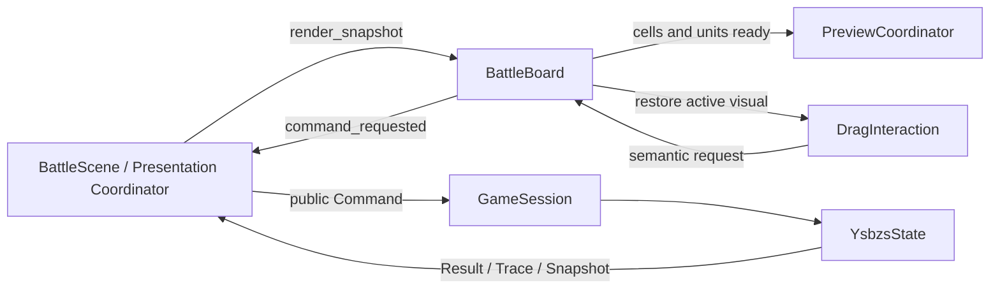

# BattleBoard 交互与预览职责拆分

status: VERIFIED
date: 2026-08-04
mock_commit: `7d5324930cbd5a48017cfafadbad5cd6760f3b55`

## 结论

原 `battle_board.gd` 的问题不是“一个战斗 Scene 天生需要很多代码”，而是三个不同生命周期被写进同一个 Scene 脚本：

1. 棋盘尺寸、坐标、Cell/Unit 对象池和 Snapshot 投影；
2. 鼠标悬停、拖拽、放置、取消和回落动画；
3. 行动范围、方向、拖拽落点和伤害预览。

这次只拆后两项。Board 仍是棋盘表现 owner，不退化为逐行转发门面；`BattleArtScene` 八节点、authored 几何、公开 Board API、Command/Trace/Snapshot 顺序均未改变。

## 拆分结果

| 文件 | 责任 | 权威边界 |
|---|---|---|
| `battle_board.gd` | 尺寸/坐标、Cell/Unit 池、Snapshot 投影、表现侧乐观落位 | 不保存玩法权威；下一份 Snapshot 覆盖本地投影 |
| `battle_board_drag_interaction.gd` | pointer、hover、drag/drop、cancel、settle、cursor、input lock | 只发语义 Command 请求，不持有 Session/State/Repository |
| `battle_board_preview_coordinator.gd` | 选中范围、方向、伤害、拖拽预览及失效 epoch | 只消费深复制 Snapshot，不计算合法性或伤害 |
| `battle_preview_presenter.gd` | 已有的只读预览策略 | 保持复用，没有复制规则 |

Board 从 1435 行收敛到 612 行。新增控制器不是为了追求更少总行数，而是把状态放回其完整生命周期 owner；总行数包含显式适配边界和专项契约测试。

## 保留与拒绝

- 保留：Board 对真实节点池、布局和 Snapshot 投影的直接拥有。这与 STS2 房间/战斗表现 owner 直接拥有视觉子树一致。
- 拒绝：继续抽 `Renderer`。目前没有第二个棋盘消费者，抽取只会制造双向调用和转发层。
- 拒绝：引入 STS2 的全局 `CombatManager.Instance` 或静态行动执行器。本项目仍以 `GameSession -> Command -> YsbzsState -> Result/Trace/Snapshot` 为唯一写路径。
- 重开条件：出现第二个真实棋盘渲染消费者，或 Board 的池/布局本身形成可独立替换生命周期。

## 调用与时序

尺寸变化先取消 drag，再调整对象池；非法落点 fail closed 且不发送 `MOVE_HERO`；输入锁阻止新交互；Scene 退出时只丢弃尚未完成的临时 tween/preview，不再触碰已离树宠物节点。

## 契约与证据

- 双仓共享三文件 SHA-256 完全一致：
  - Board: `48fceb356f245712ebcb82c6392a06b6886726fdd0276dfd00dcb278f22a066c`
  - DragInteraction: `cf4e17f08a129b08553314d167feb4194c88e599b204b1f387ec09a7ab287752`
  - PreviewCoordinator: `42054b41df103101d6da7e52fbf44d23c0deba0042aba4ae97259c233f45664d`
- Mock：职责契约、BattleArtScene、PreviewPresenter、完整 Mock 战斗 smoke、结构镜像检查均通过。
- Formal：职责契约、Presentation frozen/regressions、BattleArtScene、Trace/Snapshot staging、render delta、8x8/8x7/6x6 尺寸、移动可见投影、元素环清理、敌方攻击 VFX 均通过。
- Formal fast QA：`15/15`，证据目录 `output/validation/qa/20260804-121802-fast`。
- 真实 Godot 4.7.1、1920x1080、独立 Mirror Off 虚拟屏完成五个操作状态；修改前后 10 张 PNG 逐字节一致，证据目录 `/Users/ywh/Documents/godot-battle-ui-mock/output/validation/2026-08-04_battle_board_split/`。
- 既有 `tests/visible/smoke_battle_visible_unit_layout.gd` 仍查找历史 `BoardGrid`，且归属活动的 mouse-playtest 任务；本任务遵守文件租约，未越权修改。它不参与本次零差异门禁。

## 回滚

Mock 提交可整体 revert；正式同步提交可独立 revert。Scene、资源、核心协议、存档和回放 schema 均未修改。
